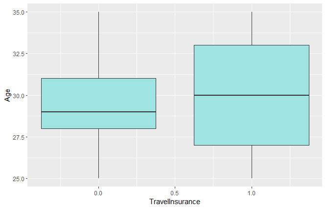
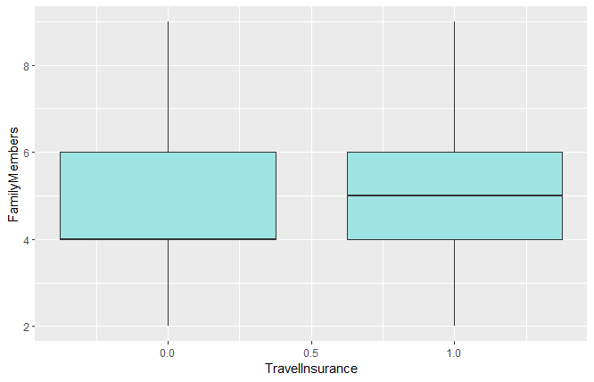
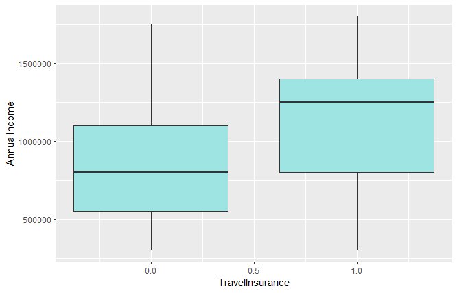

# Travel Insurance Prediction
## Analyse de données
Visualisation de l'impact des variables quantitatives sur la variables cibles:

**La variable Age:**
<table>
  <tr>
    <td align="center">
      
    </td>
  </tr>
  <tr>
    <td align="center">
      <strong>Moyennes d'âges des deux groupes</strong>
    </td>
  </tr>
</table>
On observe une différence signéficative entre les moyennes d’ages des deux groupes.

**La variable FamilyMembers:**
<table>
  <tr>
    <td align="center">
      
    </td>
  </tr>
  <tr>
    <td align="center">
      <strong>Moyennes des membres des familles des deux groupes</strong>
    </td>
  </tr>
</table>
On observe une différence significative entre les moyennes de membres de familles des deux groupes.

**La variable AnnualIncome:**
<table>
  <tr>
    <td align="center">
      
    </td>
  </tr>
  <tr>
    <td align="center">
      <strong>Moyennes du revenu annuel des deux groupes</strong>
    </td>
  </tr>
</table>
On observe une différence signéficative entre les moyennes du revenu annuel des deux groupes.

Visualisation de l'impact des variables qualitatives sur la variable cible:
